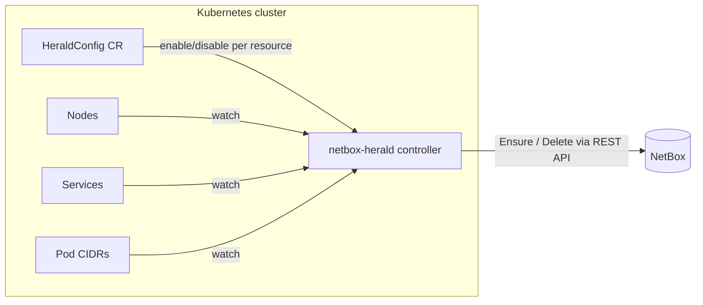

# netbox-herald

**NetBox Herald** is a Kubernetes Operator that keeps [NetBox](https://netboxlabs.com/)
in sync with the live state of a single Kubernetes cluster. It watches the
cluster itself, its Nodes, its Services, and its Pod CIDRs, and mirrors them
into NetBox as the corresponding Virtualization/DCIM/IPAM objects — so NetBox
stays an accurate source of truth without anyone hand-editing it after every
cluster change.

Every resource type Herald knows how to sync can be enabled or disabled
independently, at runtime, via a single Kubernetes custom resource
(`HeraldConfig`) — no restart required.

> **Status:** early scaffold. See [Roadmap](#roadmap) below for what's
> implemented so far.

## Why "Herald"?

A herald announces things. This operator announces what's happening inside a
Kubernetes cluster to NetBox, so NetBox doesn't fall out of date.

## Architecture



Herald reconciles the cluster's native resources continuously (via
`controller-runtime` watches) and reconciles them into NetBox using a
managed-tag + external-ID scheme, so it never touches NetBox objects it
didn't create and safely tracks renames. See
[docs/architecture.md](docs/architecture.md) for the full design.

## Resource mapping

| Kubernetes resource | NetBox object | Enable flag |
| --- | --- | --- |
| Cluster (synthetic) | Virtualization Cluster | `spec.resources.cluster` |
| Node | DCIM Device *or* Virtualization VirtualMachine | `spec.resources.nodes` |
| Service (`LoadBalancer`, external IP) | IPAM IP Address | `spec.resources.services` |
| Pod CIDR | IPAM Prefix *or* IPAM Aggregate | `spec.resources.podCIDRs` |

Details and required pre-existing NetBox objects (Site, DeviceRole,
ClusterType, ...) for each mapping are documented under
[docs/resources/](docs/resources/).

## NetBox version compatibility

| netbox-herald | NetBox |
| --- | --- |
| v0.x (unreleased) | v4.3.0 – v4.6.x (tracked as a semver range; see `spec.netbox.versionCheck`) |

## Quickstart

```sh
# 1. Create a Secret holding your NetBox API token
kubectl create secret generic netbox-herald-token \
  --from-literal=token=<your NetBox API token>

# 2. Install netbox-herald via Helm
helm install netbox-herald oci://ghcr.io/fabiomatavelli/charts/netbox-herald

# 3. Apply a HeraldConfig — see examples/ for full samples
kubectl apply -f examples/heraldconfig-devices.yaml
```

See [examples/](examples/) for complete `HeraldConfig` samples covering
bare-metal (Device-mapped) and VM-backed (VirtualMachine-mapped) clusters.

## Documentation

- [Architecture](docs/architecture.md)
- [API reference](docs/api-reference.md) (generated from the `HeraldConfig` CRD)
- Per-resource mapping details: [docs/resources/](docs/resources/)
- [Contributing](CONTRIBUTING.md)

## Roadmap

netbox-herald is being built incrementally, one reviewable PR per phase:

- [x] Phase 1 — project scaffold, `HeraldConfig` CRD, Helm chart
- [ ] Phase 2 — NetBox client wrapper, connectivity status
- [ ] Phase 3 — Cluster sync
- [ ] Phase 4 — Node sync (Device and VirtualMachine mapping)
- [ ] Phase 5 — Service sync
- [ ] Phase 6 — Pod CIDR sync
- [ ] Phase 7 — Helm chart polish, full docs, CI, release automation

## License

Apache License 2.0 — see [LICENSE](LICENSE).
